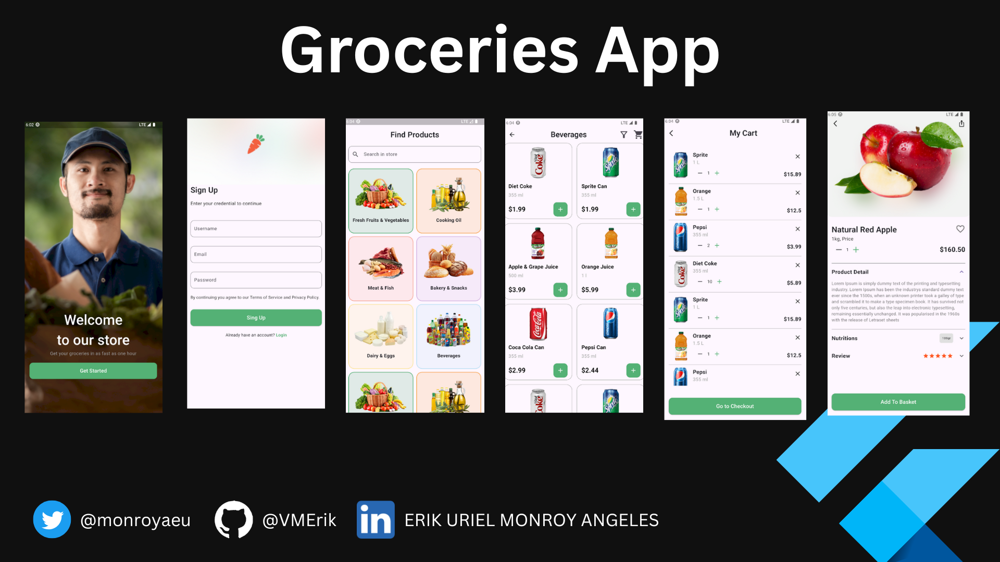

# Groceries App

Maquetacion de aplicación movil para venta de articulos de tienda.
Esta documentación detalla la configuración, dependencias y estructura básica del proyecto.

**Inspiracion tomada de** Figma Comunity
Te dejo el link de la plantilla en Figma, aqui abajo 👇👇
[Ver plantilla en Figma](https://www.figma.com/design/K0TKnoWK2xl8j3N4virnIz/Online-Groceries-App-UI--Community-?node-id=0-1&p=f&t=Lnwe8eu1LO2ia82M-0)


## 📦 Información del Proyecto

| Campo         | Valor                  |
|---------------|------------------------|
| **Nombre**    | GroceriesApp           |
| **Descripción** | Maquetacion de aplicacion movil para ventas de articulos |
| **Versión**   | 0.1.0                  |
| **SDK**       | Flutter 3.7.2          |
| **Publicación** | No se publica (`publish_to: none`) |


## 📁 Estructura del proyecto

```plaintext
/lib
  /models         # Modelos de datos (simulacion)
  /pages          # Vistas de la aplicación
  /routes         # Configuracion de Rutas con GoRoute
  /widgets        # Componentes reutilizables

/assets
  /img             # Imágenes usadas en la app
```

## ▶️ Cómo iniciar el proyecto 
```flutter pub get``` 
```flutter run ``` 


## 📷 Vista previa de vistas
